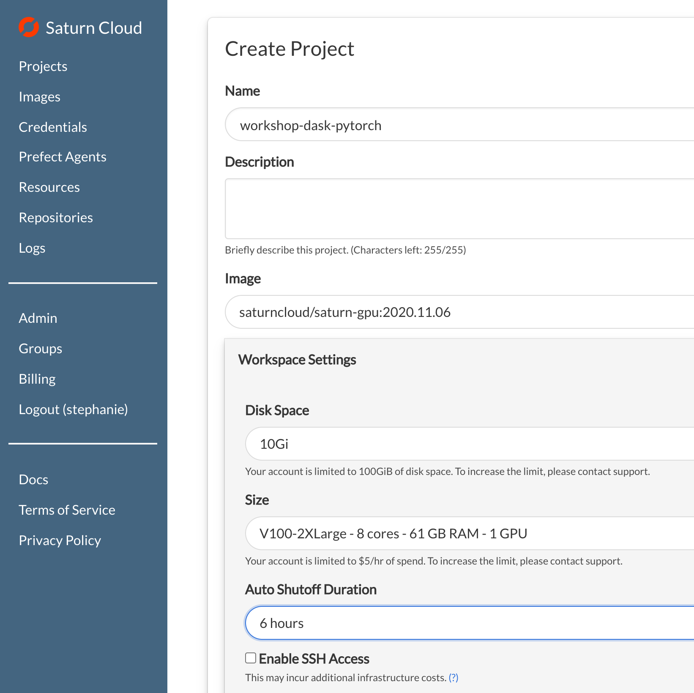
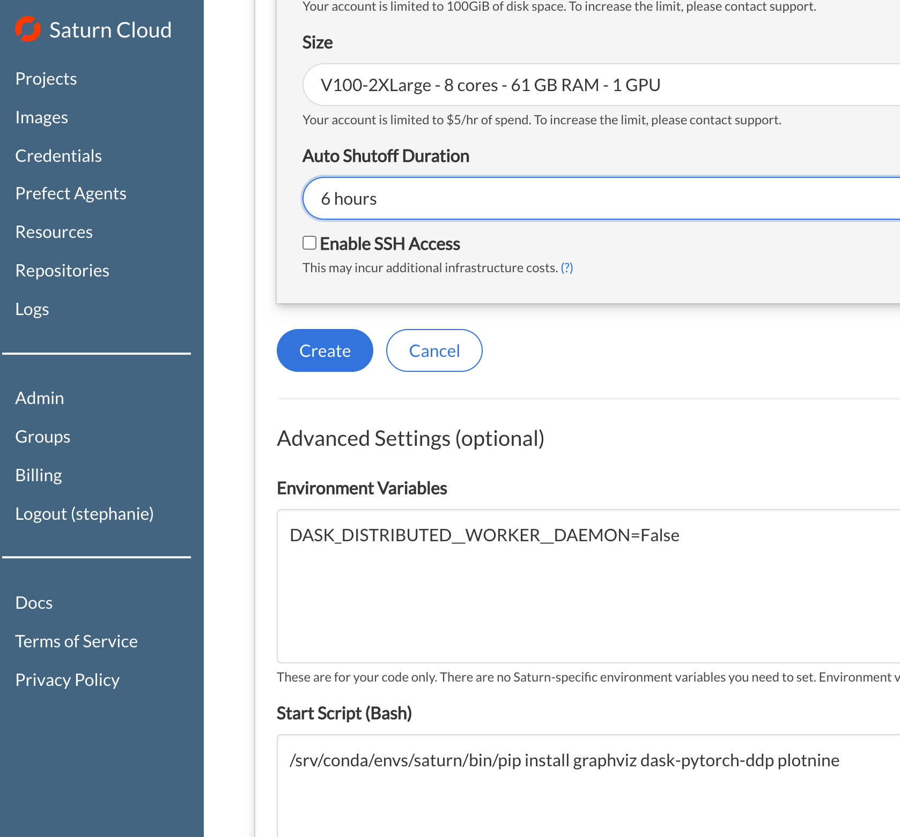
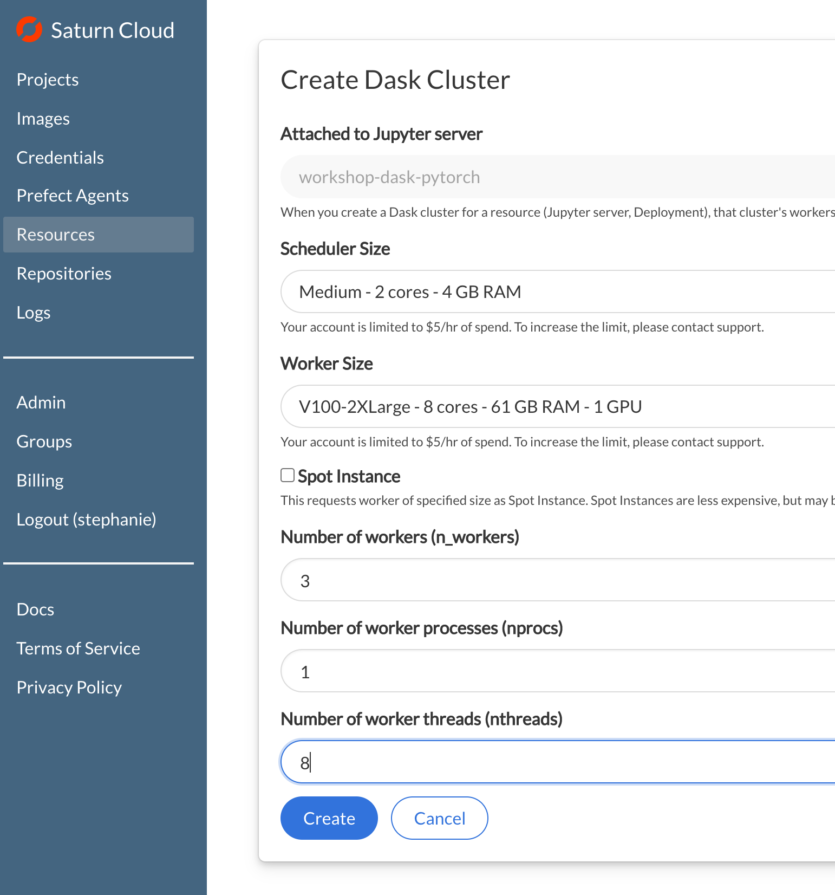

# Introduction to PyTorch with Dask

## Workshop: learn to apply Dask to improve PyTorch performance

In this workshop, attendees will have the opportunity to see how common deep learning tasks in PyTorch can be easily parallelized using Dask clusters on Saturn Cloud.

After this workshop you will know:
- Basics of how Dask works
- How to run inference with a pretrained model on Dask cluster
- How to run transfer learning on Dask cluster

To get the full learning value from this workshop, attendees should have prior experience with PyTorch. Experience with parallel computing is not needed.

## Getting Started
If you are going to work through all the exercises, please use the steps below. If you'd like to just read along and not run the code, you can use the [notebook_output](notebook_output) folder above to see all the notebooks with the code already run.

### Setup Steps

1. Create an account on [Saturn Cloud Hosted](https://accounts.community.saturnenterprise.io/register) or use your organization's existing Saturn Cloud Enterprise installation. 
1. Create a new project (keep defaults unless specified here)
    - Name: "workshop-dask-pytorch"
    - Image: `saturncloud/saturn-gpu:2020.11.30` (Or most recent date suffix available)
    - Under Advanced Settings, Start Script (Bash) add the following:   
    ` /srv/conda/envs/saturn/bin/pip install graphviz dask-pytorch-ddp plotnine`
    - Under Environment Variables, add the following:
    `DASK_DISTRIBUTED__WORKER__DAEMON=False`
    - Workspace Settings
        - Size: `V100-2XLarge - 8 cores - 61 GB RAM - 1 GPU`
    - Click "Create"
1. Attach a Dask Cluster to the project
    - Scheduler Size: `Medium`
    - Worker Size: `V100-2XLarge - 8 cores - 61 GB RAM - 1 GPU`
    - Number of workers (n_workers): 3
    - Number of worker threads (nthreads): 8
    - Click "Create"
1. Start both the Jupyter Server and Dask Cluster
1. Open Jupyter Lab
1. From Jupyter Lab, open a new Terminal window and clone the workshop-dask-pytorch repository:
    ```bash
    git clone https://github.com/saturncloud/workshop-dask-pytorch.git /tmp/workshop-dask-pytorch
    cp -r /tmp/workshop-dask-pytorch /home/jovyan/project
    ```
1. Navigate to the "workshop-dask-pytorch" folder in the File browser and start from the [01-getting-started.ipynb](01-getting-started.ipynb) notebook.


### Screenshots

The project from the Saturn UI should look similar to this:






Your JupyterLab environment should look like this:  


